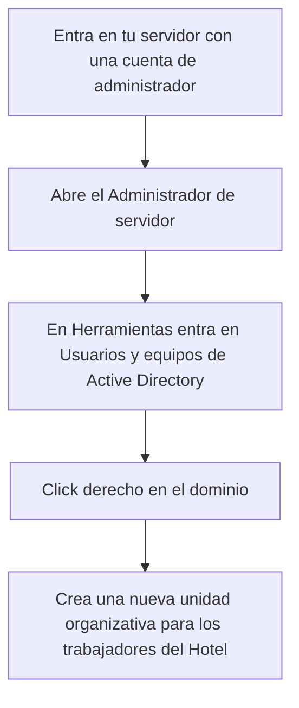

# Creación de Cuentas Operativas

### Click derecho en la unidad organizativa y “Nuevo” “Usuario”, de esta forma creas usuarios en las unidades organizativas.

### Indicas la opción “El usuario debe cambiar la contraseña en el siguiente inicio de sesión

### Entra en “Herramientas” y “Administración de directivas de grupo. Desplega las carpetas que se ven en la imagen y ahí puedes editar la longitud, caducidad... De las contraseñas.

### Vuelve a “Usuarios y equipos de Active Directory”, ves a la cuenta del trabajador que quieras, click derecho y “Propiedades”, en la sección cuenta puedes modificar las franjas horarias en las que la cuenta podrá ser usada.

# Definición de Entornos de Trabajo

### Entra en la unidad organizativa de los trabajadores del hotel y crea otra unidad organizativa dentro para los encargados de la seguridad.

### Dentro de la unidad organizativa crea un grupo y dentro del mismo las cuentas de las personas pertenecientes a la seguridad

### Crea en la unidad DVD y si no puedes en la C: una carpeta llamada finanzas, que es a la que accederán las cuentas anteriormente creadas, click derecho y Propiedades, entra en Uso compartido avanzado

### Dale a agregar, añade el grupo en el que están las cuentas que tienen que poder entrar a esta carpeta y activa la casilla de darle control total

### Click derecho en la carpeta finanzas, propiedades y ves al apartado seguridad, le das a editar, quita a los usuarios y añade a la unidad organizativa en la que están los empleados encargados de esta carpeta

### Si no te deja y te dice que ha heredado permisos antes de darle a editar entra en opciones avanzadas y dale a “desabilitar herencia” y a la primera opción “Convertir los permisos...”

### Ves a la Administración de directivas de grupo en las Herramientas, ves a la unidad organizativa del grupo de empleados que no tengan que poder tener acceso al panel de control y click derecho

### Click derecho y entra a propiedades, haz lo que ves en la captura
### Ejecutar este comando en el cmd de los ordenadores de Recepción y reiniciar gpupdate /force

# Registro de Dispositivos

A[Inicia el servidor]-->B[Entra en el Administrador del servidor]
B-->C[Herramientas]
C-->D[Administrador de directivas de grupo]
D-->E[Crear una UO llamada por ejemplo: Equipos_Hotel]
E-->F[Cambia el nombre el dispositivo fijo]
F-->G[Únelo al dominio]

# Diseño de la Estructura de Acceso

# Implementación de Grupos Funcionales

A[Estos son los grupos]-->B[Para que solo ellos tengan acceso a determinados recursos cómo carpetas]
B-->C[Click derecho en la carpeta]
C-->D[Propiedades]
D-->E[Apartado seguridad]
E-->F[Editar]
F-->G[Quita el grupo usuarios que son los todos los trabajadores y añade el grupo que tenga que acceder a esa carpeta]
G-->H[Si no te dejase quitar a los usuarios antes de darle a editar dale a opciones avanzadas y dale a deshabilitar herencia y la primera opción]

# Asignación de Permisos

### En este caso yo he creado directamente los nuevos usuarios en los grupos correspondientes, pero si no fuese así y has creado las cuentas en sitios que no son sus unidades organizativas correspondientes solo tienes que darle click derecho a la cuenta que quieras mover, pinchas la opción mover y escribes el nombre de la unidad organizativa a la que quieras moverlo

# Auditoría de Seguridad Inicial

# Movilidad y Despliegue de Perfiles

### Crea una nueva unidad organizativa para los trabajadores móviles, también crea la carpeta o carpetas correspondientes y haz lo mismo que hemos hecho con la carpeta seguridad

