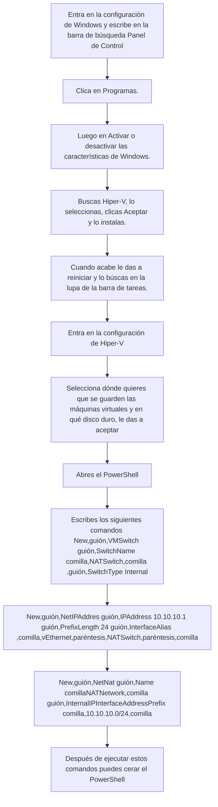
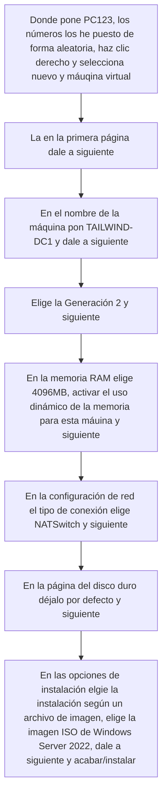
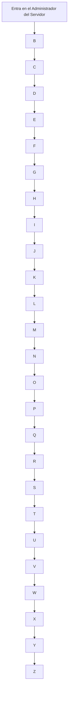

# Instalación de Active Directory
# 1. Activar e instalar Hiper-V
Durante todo este repositorio cada vez que escriba: guión, comilla o paréntesis. Seguidos o precedidos de una coma y haya mencionado que voy a proporcionar un comando me estaré refiriendo a los signos.

# 2. Creación de la Máquina virtual e instalación de Active Directory
## Creación de la máquina

## Iniciación e instalación de Active Directory

### Configuración de red

```mermaid
flowchart TD
A-->B[Dale clic derecho en la máquina virtual y ve a puntos de acceso]
B-->C[Si la opción de usar los puntos de acceso de forma automática está desactivada dale a aceptar y si no lo está desactívala, aplica los cambio y acepta]
C-->D[En tu máquina virtual dale a conectar]
D-->E[En la pantalla que te salga dale a Start]
E-->F[Cuando aparezca la pantalla en negro y el texto que te dice que apretes cualquier tecla clica la pantalla de la virtualización y pulsa el espacio]
F --> G[Si aparece algo antes del cuadrado azul que pone Install now déjalo por defecto y sigue]
G --> H[Dale a Install now]
H --> I[Todo por defecto hasta que te pida el sistema operativo a instalar, seleciona la experiencia de escritorio, suele ser la segunda opción, y dale a Next]
I --> J[Dale todo por defecto hasta que te pida que le digas que tipoo de instalación quieres, selecciona la personalizada]
J --> K[Cuando te pida que le digas dónde quieres instalar el sistema operativo selecciona la primera opción y dale a siguiente]
K --> L[Sigue todo por defecto hasta la contraseña, que tiene que tener una mayúscula, minúscula y un carácter especial cómo un punto, la que yo he puesto es Pa55w.rdPa55w.rd]
L --> M[Acaba la instalación]
M --> N[Cuando ya estés en el escritorio entra en la configuración de red]
N --> O[Entra en cambiar las opciones del adaptador]
O --> P[Clic derecho en el adaptador]
P --> Q[Propiedades]
Q --> R[Cambiar la configuración TCP/IPv4 y aceptar]
R --> S[Direccióno IP 10.10.10.10, máscara de red 255.255.255.0 y puerta de enlace 10.10.10.1]
S --> T[Servidor DNS 1.1.1.1 y 8.8.8.8]
T --> U[Cierra y cuando te pregunte si quieres que tu dispositivo sea descubrible dile que sí]
```

### Instalación de Active Directory

```mermaid
flowchart TD
A[Entra en el Administrador del Servidor] --> B[Ves al Servidor  Local]
B --> C[Clica el nombre del equipo]
C --> D[En la ventana que te aparece pulsa cambiar]
D --> E[Pónle de nombre al equipo TAILWIND-DC1, que es el nombre que le hemos puesto a la máquina virtual y a aceptar]
E --> F[Cierra la ventana y te dará la opción de reiniciar, dale a Restart Now, si no te sale la opción de restart now reinicia tú el sistema operativo]
F --> G[Cuando hayas vuelto a entrar en la cuenta de administrador y el Server Manager/Administrador del Servidor, clica la opción Administrar/Manage y Add Roles and Features/Agregar roles y características]
G --> H[Al principio dale a siguiente, en tipo de instalación selecciona la instalación basada en roles o características]
H --> I[En el destinatario elige la opción Seleccionar uno de los servidores del grupo]
I --> J[Selecciona TAILWIND-DC1 y siguiente]
J --> K[Elige el Servicio de Dominio de Active Directory/Active Directory Domain Services y agregar roles]
K --> L[siguiente Hasta el final e Install]
L --> M[Cuanto se instale dale a la bandera]
M --> N[Clica el texto en azul que dice Promover este servidor a un controlador de dominio]
N --> O[Selecciona añadir nuevo bosque y llámalo tailwindtraders.internal y siguiente]
O --> P[Deja todos las configuraciones por defecto hasta que tengas que elegir la contraseña, tienes que seguir las mismas directrices que he dicho antes, y también es recomendable que utilices la misma contraseña que te he dicho yo, Pa55w.rdPa55w.rd]
P --> Q[DNS por defecto]
Q --> R[Opciones adicionales por defecto]
R --> S[Rutas por defecto]
S --> T[Review Options y prerrequisitos por defecto]
T --> U[Instalar y reiniciar]
U --> V[Cuando vuelvas a entrar pon de nombre de usuario tailwindtraders\administrador y la contraseña]
```

### Creación de un Windows Server miembro del dominio

```mermaid
flowchart TD
A[Donde pone PC123, los números los he puesto de forma aleatoria, haz clic derecho y selecciona nuevo y máuqina virtual]-->B[La en la primera página dale a siguiente]
B-->C[En el nombre de la máquina pon TAILWIND-MBR1 y dale a siguiente]
C-->D[Elige la Generación 2 y siguiente]
D-->E[En la memoria RAM elige 4096MB, activar el uso dinámico de la memoria para esta máuina y siguiente]
E-->F[En la configuración de red el tipo de conexión elige NATSwitch y siguiente]
F-->G[En la página del disco duro déjalo por defecto y siguiente]
G-->H[En las opciones de instalación elgie la instalación según un archivo de imagen, elige la imagen ISO de Windows Server 2022, dale a siguiente y acabar/instalar]
H --> I[Clic derecho a la máquin TAILWIND-MBR1]
I --> J[En la opción puntos de acceso si la opción de usar de forma automática los puntos de acceso está desactivada acepta y sal, y si no está descativado desactívalo y aplica los cambios]
J --> K[Inicia la máquina igual que antes, conectar, Start, Install now]
K --> L[Todo por defecto hasta el tipo de sistema operativo que quieres instalar, la experiencia de escritorio]
L --> M[Sigue todo por defecto hasta que te pregunte el tipo de instalación quieres, la personalizada, luego, dónde quieres instalar el sistema, en el primer disco que aparece y siguiente]
M --> N[Cuando tengas que seleccionar la contraseña pon la de antes, Pa55w.rdPa55w.rd y acabar]
N --> O[Entra en las opciones de red y cambiar las opciones de adaptador, TCP/IPv4, propiedades]
O --> P[IP 10.10.10.20, máscara 255.255.255.0 y puerta de enlace 10.10.10.1]
P --> Q[DNS 10.10.10.10 y 8.8.8.8]
Q --> R[Cierra y cuando te pregunte si quieres permitir que tu dispositivo sea descubierto di que si]
R --> S[Entra en el Administrador del Servidor, Servidor Local y cambia el nombre del equiupo a TAILWIND-MBR1, acepta y reinicia]
S --> T[Entra en la consola del Administrador del Servidor]
T --> U[Ves a la sección del Servidor Local]
U --> V[Clica cambiar en las propiedades del sistema]
V --> W[Cambia el nombre de domninio a TAILWINDTRADERS y aceptar]
```

## Instalación de Active Directory en la segunda máquina

```mermaid
flowchart TD
A --> B[Cuando hayas entrado ves al Server Manager/Administrador del Servidor, clica la opción Administrar/Manage y Add Roles and Features/Agregar roles y características]
B --> C[Al principio dale a siguiente, en tipo de instalación selecciona la instalación basada en roles o características]
C --> D[En el destinatario elige la opción Seleccionar uno de los servidores del grupo]
D --> E[Selecciona TAILWIND-DC1 y siguiente]
E --> F[Elige el Servicio de Dominio de Active Directory/Active Directory Domain Services y agregar roles]
F --> G[siguiente Hasta el final e Install]
G --> H[Cuanto se instale dale a la bandera]
H --> I[Clica el texto en azul que dice Promover este servidor a un controlador de dominio]
I --> J[Selecciona añadir un controlador de dominio a un dominio existente y escribe tailwindtraders.internal]
J --> K[Cuando hayas introducido el dominio clica en la casilla de al lado que pone seleccionar y pon en el nombre de usuario TAILWINDTRADERS\Administrador y en la contraseña la que hayas establecido, en mi caso Pa55w.rdPa55w.rd]
K --> L[En la seiguiente pestaña, las opciones de controlador de dominio, déjalas por defecto y en el modo de restauración de servicios de directorio DSRM, escribe la misma contraseña que antes]
L --> M[DNS por defecto]
M --> N[Opciones adicionales por defecto]
N --> O[Rutas por defecto]
O --> P[Review Options y prerrequisitos por defecto]
P --> Q[Cuando se reinicie inicia sesión como tailwindtraders\Administrador con la contraseña que has estado utilizando todo el rato]
```

### Transferir el RID Master a la segunda máquina

